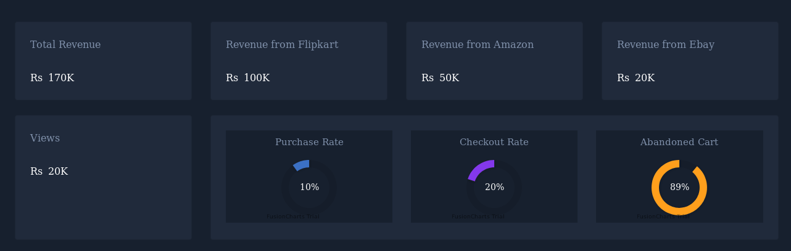
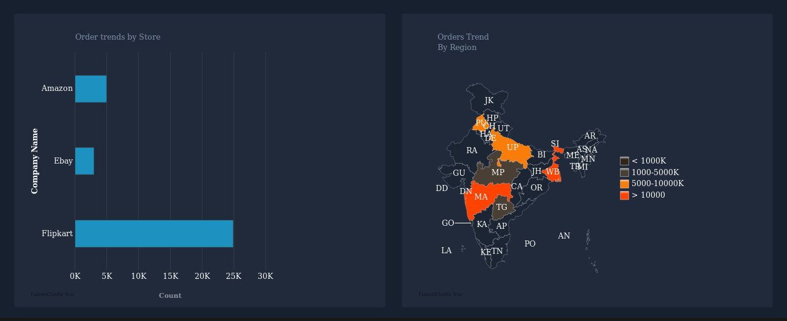

# Analytics Dashboard
An general purpose analytics dashboard for the items sold across India from different E-Commerce platform

[](https://github.com/nightwarriorftw/AnalyticsDashboard/issues) [](https://github.com/nightwarriorftw/AnalyticsDashboard/network/members) [](hhttps://github.com/nightwarriorftw/AnalyticsDashboard/stargazers)   [](https://twitter.com/intent/follow?screen_name=nightwarriorftw) [](https://telegram.me/nightwarriorftw)


## :nut_and_bolt: Development


#### 1. Clone the Repository

```Bash
git clone https://github.com/nightwarriorftw/AnalyticsDashboard.git
cd AnalyticsDashboard
```

#### 2. Install the dependencies

```BASH
yarn install
```

#### 3. Run server:

```BASH
yarn start
```

# :camera: Gallery




## :zap: Demo

[https://analyticsdashboard007.netlify.app/](https://analyticsdashboard007.netlify.app/)

## :file_folder: File structure
```
├── package.json
├── public
│   ├── 1.png
│   ├── 2.png
│   ├── favicon.ico
│   ├── index.html
│   ├── logo.png
│   ├── manifest.json
│   └── robots.txt
├── README.md
├── src
│   ├── App.css
│   ├── App.js
│   ├── App.test.js
│   ├── chart-theme.js
│   ├── components
│   │   ├── Main
│   │   │   ├── DetailsChart.js
│   │   │   ├── DetailsDonut.js
│   │   │   ├── DetailsSection.js
│   │   │   ├── Footer.js
│   │   │   └── main.js
│   │   ├── Navigations
│   │   │   └── navbar.js
│   │   └── snippets
│   │       ├── CardDetails.js
│   │       ├── Chart.js
│   │       ├── Maps.js
│   │       ├── MiniCardDetail.js
│   │       ├── Rate.js
│   │       └── TotalAmount.js
│   ├── index.css
│   ├── index.js
│   ├── serviceWorker.js
│   └── setupTests.js
└── yarn.lock

```

## :star2: Credit/Acknowledgment
[Aman Verma](https://nightwarriorftw.netlify.app)
- Github [@nightwarriorftw](https://www.github.com/nightwarriorftw)
- LinkedIn [developer-aman-verma](https://www.linkedin.com/in/developer-aman-verma/)
- Twitter [@nightwarriorftw](https://www.twitter.com/nightwarriorftw)

## :lock: License

[LICENSE](/LICENSE)


